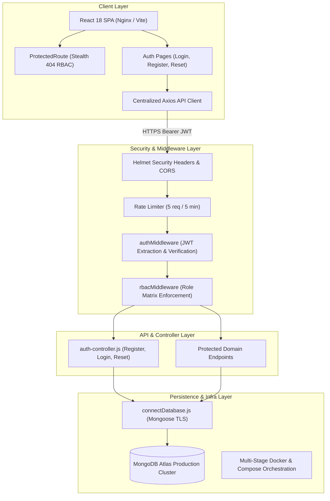

# Qader Academy - Technical Project Handover & Architecture Transfer

**Document Owner & Lead Contributor:** Fisal (Platform, Security & Authentication Lead)  
**Target Audience:** Engineering Supervisors, DevOps Engineers & Incoming Maintainers  
**Repository:** `QaderTech / Qader Academy`  
**Date:** August 2026  
**Version:** 1.0.0 (Production Release)  

---

## 1. Executive Summary & Contribution Scope

This document provides a formal, comprehensive technical handover of all architecture, subsystems, and infrastructure designed and implemented during the platform development and deployment lifecycle. The scope encompasses six core modules spanning Backend Architecture, Frontend Client & Route Protection, Security Engineering, Database Systems, Automated QA & CI Pipelines, and Production Cloud Infrastructure.



---

## 2. Logical Module Breakdown

### Module 1: Backend Authentication, Authorization & Identity Management

#### Architectural Overview
The authentication subsystem is a stateless, token-based identity platform built on Express and JSON Web Tokens (JWT) using `bcryptjs` password hashing with a cost factor of 10. The system guarantees zero session affinity, deterministic role assignment (`student`, `instructor`, `admin`), and strict JWT lifecycle verification.

#### Implemented Components & Core Functions
* **Controller Layer (`backend/controllers/auth-controller.js`)**:
  * `register`: Validates required fields (`name`, `email`, `password`), enforces 8+ character password entropy, rejects duplicate emails, hashes passwords via `bcrypt.hash(password, 10)`, and issues a 7-day signed JWT.
  * `login`: Authenticates credentials using `bcrypt.compare`, signs and returns a 7-day JWT, and strips `passwordHash` from the response payload.
  * `logout`: Stateless logout endpoint allowing frontend clients to flush persisted auth state.
  * `resetPassword`: Issues a cryptographically signed, 15-minute scoped reset token with explicit `purpose: 'password_reset'` validation, safely dispatched (with debug logging strictly suppressed in production).
  * `confirmPasswordReset`: Verifies the token signature, checks expiration, updates `passwordHash`, and invalidates prior reset tokens.
* **Routing Layer (`backend/routes/auth-routes.js`)**:
  * Mounts `/api/v1/auth/register`, `/api/v1/auth/login`, `/api/v1/auth/logout`, `/api/v1/auth/reset-password`, and `/api/v1/auth/confirm-reset-password`.
* **Middlewares**:
  * `authMiddleware` (`backend/middlewares/auth-middleware.js`): Extracts the JWT from `req.headers.authorization` (`Bearer <token>`). Verifies cryptographic validity, normalizes caller identity to `req.user` (`userId`, `_id`, `id`, `role`), and maps `TokenExpiredError` and `JsonWebTokenError` to standardized 401 payloads.
  * `rbacMiddleware` (`backend/middlewares/rbac-middleware.js`): Role-Based Access Control higher-order middleware that accepts an arbitrary set of allowed roles (e.g., `rbacMiddleware('admin', 'instructor')`). Generates dynamic 403 Forbidden responses stating the exact permitted role set upon denial.
  * `rate-limit-middleware.js` (`backend/middlewares/rate-limit-middleware.js`): Contains `loginLimiter` and `resetPasswordLimiter`, bounding auth requests to **5 attempts per 5-minute window** to prevent brute-force attacks.

#### Maintainer Guidance
> **Rule of Thumb:** When adding new protected endpoints, always chain `authMiddleware` before `rbacMiddleware`:
> ```javascript
> router.post('/courses', authMiddleware, rbacMiddleware('instructor', 'admin'), courseController.createCourse);
> ```
> Never query `User.findOne({ email })` without sanitizing input or using Mongoose's parameterized query bindings.

---

### Module 2: Frontend Authentication Pages, Service Layer & Stealth Route Protection

#### Architectural Overview
The client-side architecture contains typed service wrappers, centralized HTTP interceptors, reactive auth form pages with inline validations, and a zero-knowledge **Stealth 404** route protection wrapper to prevent route enumeration attacks.

#### Implemented Components & Core Functions
* **Typed Service Layer (`frontend/src/services/auth-service.ts`)**:
  * Implements `registerUser`, `loginUser`, `requestPasswordReset`, and `confirmPasswordReset`.
  * Exports TypeScript interfaces including `UserProfile`, `RegisterCredentials`, `LoginResponse`, and `RegisterResponse`.
* **Centralized API Client (`frontend/src/api/axios.ts`)**:
  * Dynamically consumes `import.meta.env.VITE_API_BASE_URL` with zero hardcoded `localhost` fallback defaults.
  * Injects `Authorization: Bearer <token>` into outgoing request headers.
  * Implements response interceptors that cleanly reject 401s on invalid login/register credentials without triggering unauthorized page redirects or full-page loops.
* **UI Authentication Pages**:
  * `LoginPage.tsx` (`frontend/src/pages/LoginPage.tsx`): Interactive form with inline email/password validation, credential error alerts, and auto-redirect for existing sessions.
  * `RegisterPage.tsx` (`frontend/src/pages/RegisterPage.tsx`): Multi-role registration interface with password entropy validation.
  * `ForgotPasswordPage.tsx` (`frontend/src/pages/ForgotPasswordPage.tsx`): Self-service password recovery form.
  * `ResetPasswordPage.tsx` (`frontend/src/pages/ResetPasswordPage.tsx`): Password reset confirmation interface with token extraction from query parameters and password confirmation matching.
* **Stealth Route Guard (`frontend/src/components/ProtectedRoute.tsx`)**:
  * Protects administrative and instructor routes in `frontend/src/App.tsx`.
  * **Stealth 404 Behavior:** Unauthenticated users or users lacking required privileges are served the `NotFoundPage` rather than a 403 Forbidden, concealing sensitive internal routes (`/admin`, `/instructor/*`) from unauthorized discovery.

#### Maintainer Guidance
> When adding new administrative routes, wrap them inside `<ProtectedRoute allowedRoles={['admin']}>` or `<ProtectedRoute allowedRoles={['instructor', 'admin']}>` in `frontend/src/App.tsx`.

---

### Module 3: Security Engineering & OWASP Top 10 Hardening

#### Architectural Overview
Conducted a full-spectrum security audit and implemented hardening across the entire application stack, documented in the compliance report `docs/security/owasp-top-10-checklist.md`.

#### Key Remediations Implemented
| Vulnerability Class | Specific Vulnerability Remedied | Implementation Details |
| :--- | :--- | :--- |
| **A01: Broken Access Control** | BOLA / IDOR on Progress & Enrollments | Scoped student actions strictly to `req.user.userId` in `enrollmentController.js` and `progressController.js`. |
| **A01: Broken Access Control** | Certificate Path Traversal | Enforced `path.resolve` checks and existence verification before serving downloads in `certificateRoutes.js`. |
| **A02: Cryptographic Failures** | Admin Hash Leakage | Fixed projection from `.select('-password')` to `.select('-passwordHash')` in `admin-controller.js`. |
| **A03: Injection** | Regular Expression Denial of Service (ReDoS) | Escaped metacharacters in admin user search queries before passing to Mongoose `$regex`. |
| **A04: Insecure Design** | Password Reset Token Exposure | Suppressed console emission of reset tokens in production environments in `auth-controller.js`. |
| **A05: Security Misconfiguration** | Missing HTTP Headers & Wildcard CORS | Configured `helmet` in `backend/server.js` with strict CSP, HSTS, `X-Frame-Options: SAMEORIGIN`, `nosniff`, and restricted CORS to configured frontend origins. |
| **A05: Security Misconfiguration** | Stack Trace Information Disclosure | Implemented global error-handling middleware in `backend/server.js` to sanitize production API errors. |

---

### Module 4: Database Modeling & Connection Infrastructure

#### Architectural Overview
Configured the primary database infrastructure connecting Mongoose with MongoDB Atlas, establishing robust schema definitions and secure connection lifecycle management.

#### Implemented Components & Core Functions
* **User Data Model (`backend/models/user.js`)**:
  * Schema definition with `name`, `email` (unique, lowercase, indexed), `passwordHash`, `role` (enum: `student`, `instructor`, `admin`), `avatar`, `resetPasswordToken`, and `resetPasswordExpires`.
* **Database Connection Manager (`backend/config/connectDatabase.js`)**:
  * Initializes TLS-encrypted Mongoose connection using `process.env.MONGO_URI` with clear connection event telemetry.

---

### Module 5: Test Infrastructure, Automated CI Pipeline & Quality Assurance

#### Architectural Overview
Engineered an automated continuous integration pipeline in GitHub Actions combined with comprehensive backend integration suites (using `mongodb-memory-server` and `supertest`) and frontend unit tests (using `vitest` and `@testing-library/react`).

#### Implemented Components & Test Suites
* **CI Workflow Configuration (`.github/workflows/ci.yml`)**:
  * Multi-job pipeline executing linting, TypeScript type compilation, backend test suites, and frontend test suites on pull requests and pushes to `main` and `develop`.
* **Backend Test Framework & Test Environment (`backend/tests/setup.js`)**:
  * Implements `connect()`, `clearDatabase()`, and `closeDatabase()` in-memory database lifecycle hooks with mock fallbacks for CI isolation.
* **Auth & Security Test Suites**:
  * `backend/tests/auth/register.test.js`: Validates input parsing, schema constraints, and password hashing.
  * `backend/tests/auth/login.test.js`: Tests credential validation, token issuance, and bad password rejections.
  * `backend/tests/auth/logout.test.js`: Verifies logout endpoint contract.
  * `backend/tests/auth/auth-middleware.test.js`: Tests valid tokens, missing tokens, malformed headers, and token expiration.
  * `backend/tests/auth/rbac-middleware.test.js`: Tests 200 allow and 403 deny across varying role combinations.
  * `backend/tests/auth/rate-limit.test.js`: Tests rate limiting on auth endpoints after 5 requests.
  * `backend/tests/auth/confirm-reset.test.js`: Tests password reset tokens, expiry, and hash updating.
  * `backend/tests/security/access-control.test.js`: Tests BOLA/IDOR protections across endpoints.
  * `backend/tests/security/helmet.test.js`: Asserts HTTP response headers for Helmet security policies.
* **Frontend Protected Route Test Suite (`frontend/src/tests/protected-routes.test.tsx`)**:
  * 12 automated unit tests validating stealth 404 access control for `/admin`, `/instructor`, `/instructor/courses`, and `/instructor/courses/new`.
* **CI Hotfix Remediations (PR #39 & PR #40)**:
  * Resolved routing conflicts and fixed broken middleware import paths across `enrollmentRoutes.js`, `progressRoutes.js`, and `adminRoutes.js`.
  * Added missing `express-validator` package to backend dependencies.

---

### Module 6: DevOps, Production Containerization & Cloud Deployment Architecture

#### Architectural Overview
Standardized production containerization for zero-downtime deployment on Render Web Services and Docker Compose, documented in detail in the production runbook `docs/deployment-runbook.md`.

#### Implemented Components & Configurations
* **Production Deployment Runbook (`docs/deployment-runbook.md`)**:
  * Comprehensive 7-stage guide covering MongoDB Atlas provisioning, Render Docker deployment, environment variables, health checks, and day-2 operations.
* **Frontend Multi-Stage Dockerfile & Nginx Configuration**:
  * `frontend/Dockerfile`: Stage 1 builds the Vite static bundle; Stage 2 serves assets using `nginx:1.27-alpine`.
  * `frontend/nginx.conf`: Configured for SPA client-side routing fallback (`try_files $uri $uri/ /index.html`), gzip compression, and caching headers.
* **Backend Hardened Dockerfile (`backend/Dockerfile`)**:
  * Based on `node:20-alpine`, bundled with Chromium and system font dependencies (`nss`, `freetype`, `harfbuzz`, `ttf-freefont`) for Puppeteer certificate rendering.
  * Executes under a non-root system user (`qaderuser:qadergroup`).
* **Docker Compose Orchestration (`docker-compose.prod.yaml`)**:
  * Unified service definition for full-stack local production simulation and self-hosted deployments with built-in backend healthcheck validation.
* **Environment Variable Standards**:
  * `backend/.env.example` and `frontend/.env.example`: Configured as the single source of truth for runtime variables.
  * `frontend/vite.config.ts`: Added `server.allowedHosts: true` for cloud domain routing.

---

## 3. Platform Infrastructure & Cloud Account Handover

> [!IMPORTANT]
> **Administrative Account Delivery:**  
> The administrative master accounts, login credentials, and project management links for both **MongoDB Atlas** and **Render.com** hosting the live production database and web services have been **securely transferred to the Trainer / Supervisor directly via Slack Direct Message (DM)**.

### 1. MongoDB Atlas (Production Database Service)
* **Official Management Portal:** [https://account.mongodb.com/account/login](https://account.mongodb.com/account/login)  
* **Account Delivery:** Master credentials shared with supervisor via Slack DM.  
* **Production Cluster:** `qader-cluster` (Database: `qader_academy_prod`)  
* **Required Maintenance Role:** `Project Data Access Admin` or `Project Owner`  
* **Key Security Instructions for Handler:**
  1. Access the designated production cluster (`qader-cluster`).
  2. Configure Network Access and IP Whitelisting:

> [!CAUTION]
> **Production Security Mandate (IP Whitelisting):**  
> During the development phase, `0.0.0.0/0` (Allow Access from Anywhere) was temporarily used so the development team could connect across varied local networks. **In production, `0.0.0.0/0` represents a significant security exposure.**  
> 
> The incoming engineer must navigate to **Security** > **Network Access** > **IP Access List**, remove `0.0.0.0/0`, and whitelist **only the dedicated outbound IP address(es) of the production backend service/cluster** (or configure VPC Peering / AWS PrivateLink).

  3. **Database Access & Least-Privilege RBAC:**
     - Enforce strict Least-Privilege RBAC for production database users (e.g., `readWrite` restricted strictly to `qader_academy_prod`).
     - Avoid using shared developer credentials in production; generate high-entropy passwords (32+ characters) stored in a secure secret manager.

### 2. Render.com (Container Cloud Hosting Platform)
* **Official Management Portal:** [https://dashboard.render.com/login](https://dashboard.render.com/login)  
* **Account Delivery:** Master administrative login shared with supervisor via Slack DM.  
* **Required Workspace Role:** Team Member / Admin on the `Qader Academy` Workspace  
* **Managed Production Web Services:**
  * **Backend Web Service (`qader-academy-backend-docker`)**: Docker container running on Port `5000` (Node.js 20 Express REST API with Puppeteer Chromium).
  * **Frontend Web Service (`qader-academy-frontend-docker`)**: Docker multi-stage container running on Port `80` (React 18 SPA served by Nginx).
* **Key Operational Instructions for Handler:**
  1. Verify zero-downtime deployment pipelines triggered upon pushes to `main`.
  2. Maintain and rotate environment secrets under the **Environment** tab of each service.
  3. Ensure `VITE_API_BASE_URL` on the frontend service points to the live backend service URL.

---

## 4. Operational Runbook & Maintainer Quick Reference

### Core Development & Validation Commands

```bash
# 1. Run all Backend Unit & Integration Tests (including Auth & Security)
cd backend
npm test

# 2. Run all Frontend Unit Tests (including ProtectedRoute RBAC)
cd frontend
npm test

# 3. Build and Run Local Production Stack via Docker Compose
docker compose -f docker-compose.prod.yaml up --build
```

### Environment Variable Checklist

| Environment Variable | Service | Required In | Description / Example |
| :--- | :--- | :--- | :--- |
| `PORT` | Backend | Local & Prod | Server port (Default: `5000`) |
| `MONGO_URI` | Backend | Local & Prod | MongoDB Atlas connection string with TLS |
| `JWT_SECRET` | Backend | Local & Prod | 64+ char cryptographic key for signing JWTs |
| `FRONTEND_URL` | Backend | Local & Prod | Whitelisted CORS origin (e.g. `https://qader-academy.onrender.com`) |
| `NODE_ENV` | Backend | Local & Prod | `development` or `production` |
| `VITE_API_BASE_URL` | Frontend | Local & Prod | Backend API URL (e.g. `https://qader-backend.onrender.com/api/v1`) |

---

*This document serves as the formal architectural transfer and maintenance reference for the Qader Academy codebase.*
